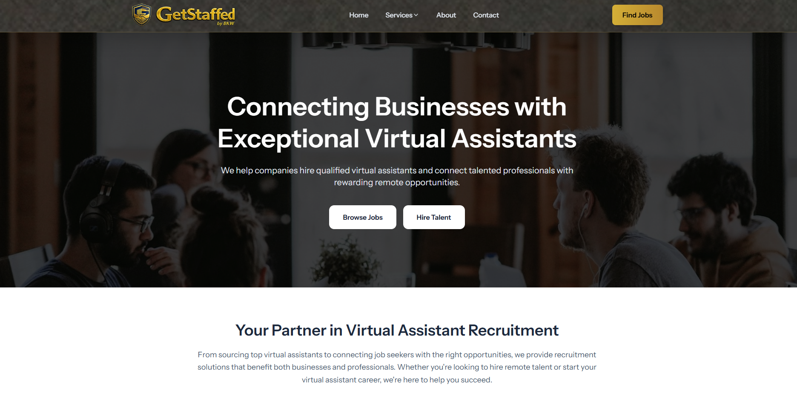
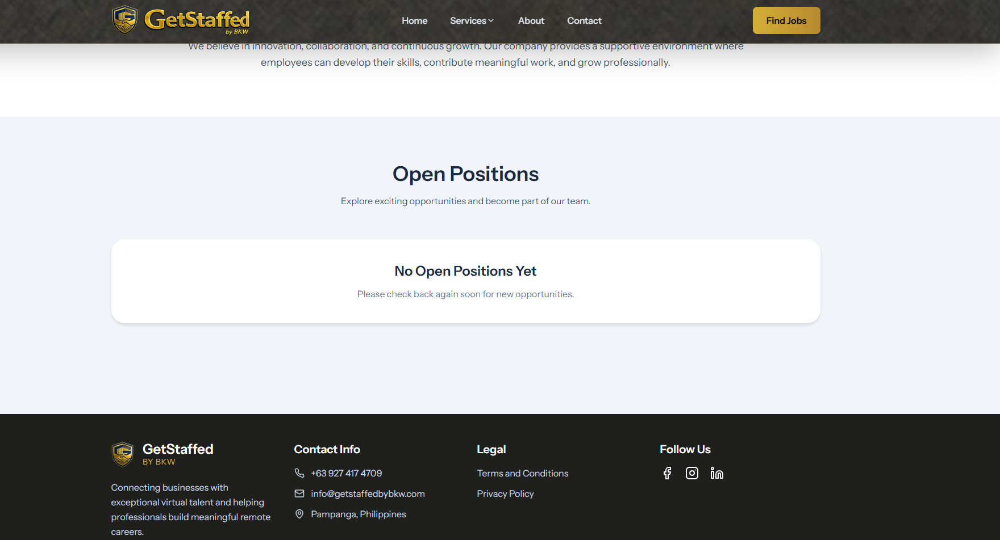
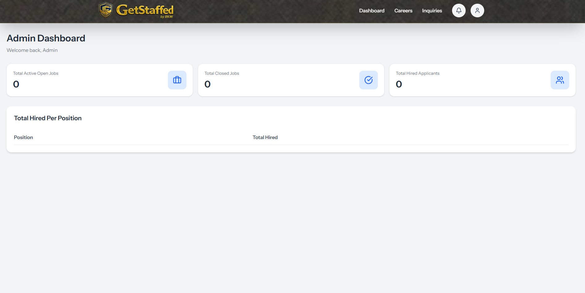
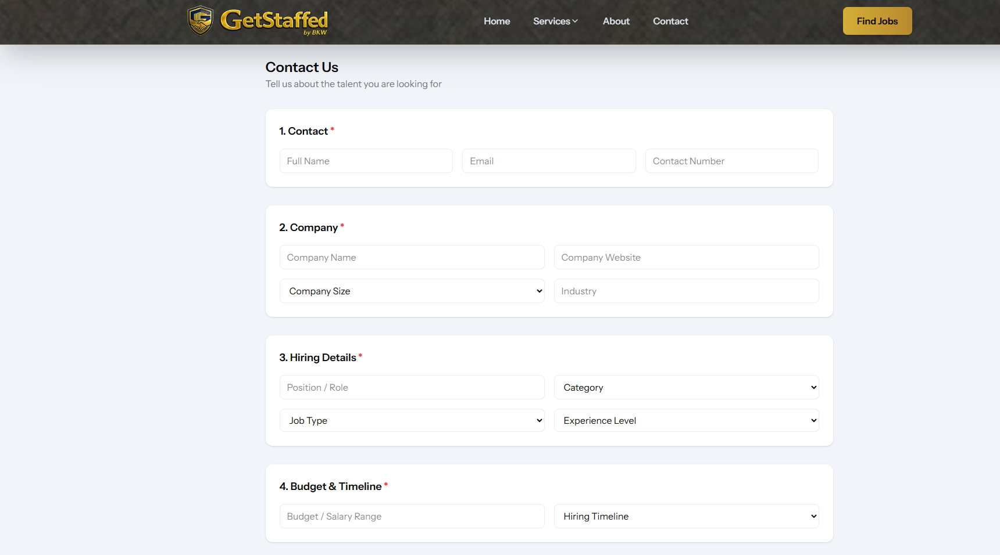

# Online Job Recruitment System

A full-stack web application that connects employers with job seekers through an online recruitment platform. Employers can publish job openings, manage applications, and review applicants, while job seekers can browse available positions and submit applications online.

This project was developed to strengthen my skills in Laravel, React, TypeScript, REST APIs, and modern web application development.

---

## Project Overview

The Online Job Recruitment System streamlines the recruitment process by providing a centralized platform for both employers and applicants.

### Employers can:

- Create and manage job postings
- View submitted applications
- Review applicant information
- Update job status (Open/Closed)
- Manage website inquiries
- View dashboard statistics

### Applicants can:

- Browse available job openings
- View detailed job descriptions
- Submit job applications online
- Upload resumes
- Send inquiries through the contact page

---

## Features

### Authentication

- Secure Login
- User Registration
- Role-based Access
- Protected Admin Pages

### Admin Panel

- Dashboard
- Career Management
- Job Posting Management
- Applicant Management
- Contact Messages
- Website Statistics

### Career Module

- Job Listings
- Job Details
- Apply Online
- Resume Upload
- Application Tracking

### Contact Module

- Contact Form
- Email Notifications
- Automatic Reply Emails
- Queue-based Email Processing

### Website

- Responsive Landing Page
- About Section
- Careers Page
- Contact Page
- Privacy Policy
- Terms & Conditions

---

## Tech Stack

### Backend

- Laravel
- PHP
- MySQL
- REST API
- Laravel Queue
- Laravel Mail

### Frontend

- React
- TypeScript
- Tailwind CSS
- Inertia.js
- Vite

### Tools

- Git
- GitHub
- Composer
- npm

---

## Screenshots

### Home Page



### Careers Page



### Admin Dashboard



### Contact



- Home Page
- Careers Page
- Job Details
- Application Form
- Contact Page
- Admin Dashboard
- Career Management
- Applicant List
- Contact Messages

---

## Installation

### Clone Repository

```bash
git clone https://github.com/iammark989/laravel_onlinejobapplication.git
```

### Navigate to Project

```bash
cd laravel_onlinejobapplication
```

### Install PHP Dependencies

```bash
composer install
```

### Install Node Packages

```bash
npm install
```

### Copy Environment File

```bash
cp .env.example .env
```

### Generate Application Key

```bash
php artisan key:generate
```

### Configure Database

Update your `.env` file.

```env
DB_DATABASE=your_database
DB_USERNAME=root
DB_PASSWORD=
```

### Run Migrations

```bash
php artisan migrate
```

### Create Storage Link

```bash
php artisan storage:link
```

### Start Laravel

```bash
php artisan serve
```

### Start Vite

```bash
npm run dev
```

---

## Future Improvements

- Employer Registration
- Company Profiles
- Job Categories
- Saved Jobs
- Interview Scheduling
- Email Verification
- Applicant Dashboard
- Resume Builder
- Advanced Search & Filters
- Notification System

---

## Skills Demonstrated

- Full Stack Web Development
- REST API Development
- Authentication & Authorization
- Database Design
- CRUD Operations
- File Upload Handling
- Queue Processing
- Email Notifications
- Responsive UI Development
- MVC Architecture

---

## Project Status

✅ Portfolio Project

This project is actively maintained as part of my portfolio while I continue learning and improving my full-stack development skills.

---

## Author

**Mark Arvin Valenzuela**

Junior Full Stack Web Developer

### Technologies

- Laravel
- PHP
- React
- TypeScript
- Tailwind CSS
- MySQL

GitHub:
https://github.com/iammark989

LinkedIn:
https://www.linkedin.com/in/mark-arvin-valenzuela

Portfolio:
https://markvalenzuela.online/

---

## License

This project is intended for educational and portfolio purposes.
